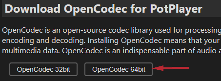
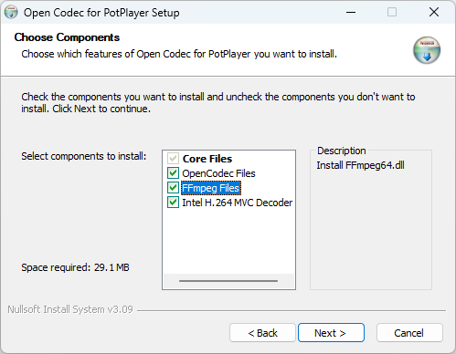
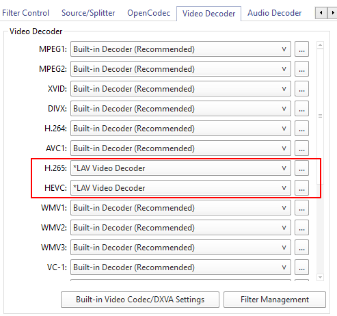

## 1. Download [OpenCodec](https://potplayer.org/en/opencodec.html)

## 2. Install OpenCodec

## 2.1 LavFilters

Download [LavFilters](https://github.com/nevcairiel/lavfilters/releases)

Add LavFilters in PotPlayer

## 3. Change PotPlayer Decoder

Open PotPlayer > Settings > Performance > Filters control > Video Decoder

Reference:\
[OpenCodec for PotPlayer](https://potplayer.org/en/opencodec.html)\
[Lavfilters](https://github.com/nevcairiel/lavfilters/releases)\
[how-to-play-hevc-h265-files-with-potplayer](https://www.free-codecs.com/guides/how-to-play-hevc-h265-files-with-potplayer.htm)
