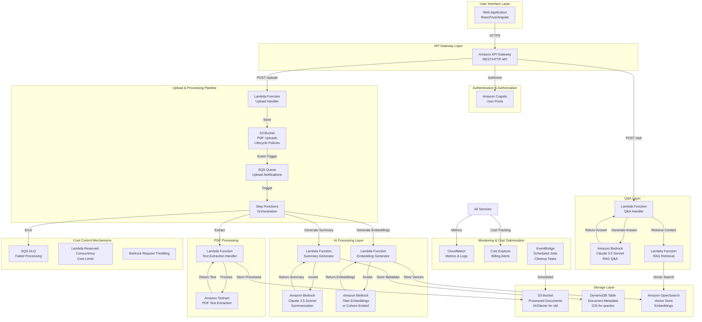

# Serverless PDF Q&A System on AWS

## High-Level Architecture



## Architecture Components

### 1. **Upload Layer**

#### Amazon S3 - PDF Storage

- **Bucket 1**: `pdf-uploads` (Standard storage)
  - Upload via presigned URLs or direct POST
  - Server-side encryption (SSE-S3 or SSE-KMS)
  - Lifecycle policy: Move to IA after 30 days, Glacier after 90 days
  - Event notifications to SQS on upload

#### API Gateway + Lambda (Upload Handler)

- Validates file type (PDF only)
- Checks file size limits (e.g., 50MB max)
- Generates presigned URLs for direct S3 upload (reduces Lambda time)
- Creates metadata entry in DynamoDB

### 2. **Processing Pipeline**

#### Amazon Step Functions (State Machine)

Orchestrates the entire processing workflow:

```json
{
  "Comment": "PDF Processing Pipeline",
  "StartAt": "ExtractText",
  "States": {
    "ExtractText": {
      "Type": "Task",
      "Resource": "arn:aws:lambda:...:function:ExtractText",
      "Next": "GenerateSummary",
      "Retry": [
        {
          "ErrorEquals": ["States.TaskFailed"],
          "IntervalSeconds": 2,
          "MaxAttempts": 3,
          "BackoffRate": 2.0
        }
      ],
      "Catch": [
        {
          "ErrorEquals": ["States.ALL"],
          "Next": "NotifyFailure",
          "ResultPath": "$.error"
        }
      ]
    },
    "GenerateSummary": {
      "Type": "Task",
      "Resource": "arn:aws:lambda:...:function:GenerateSummary",
      "Next": "GenerateEmbeddings"
    },
    "GenerateEmbeddings": {
      "Type": "Task",
      "Resource": "arn:aws:lambda:...:function:GenerateEmbeddings",
      "Next": "StoreResults"
    },
    "StoreResults": {
      "Type": "Task",
      "Resource": "arn:aws:lambda:...:function:StoreResults",
      "End": true
    }
  }
}
```

#### Amazon Textract

- Async document analysis API
- Handles multi-page PDFs
- Extracts text with layout preservation
- Cost: ~$1.50 per 1000 pages

### 3. **AI Processing Layer**

#### Amazon Bedrock - Claude 3.5 Sonnet

- **Summarization**: Use `anthropic.claude-3-5-sonnet-20241022-v2:0`

  - Prompt engineering for structured summaries
  - Token limits: Input up to 200K tokens, output 8K tokens
  - Cost: ~$3/million input tokens, ~$15/million output tokens

- **Q&A with RAG**:
  - Retrieve relevant chunks via vector search
  - Provide context to Claude for answer generation
  - Streaming responses for better UX

#### Embedding Generation

- **Option 1**: Amazon Titan Embeddings (`amazon.titan-embed-text-v2`)
  - Cost-effective, managed service
  - 1024-dimension vectors
- **Option 2**: Cohere Embed (`cohere.embed-english-v3`)
  - Higher quality, better semantic understanding
  - 1024-dimension vectors

### 4. **Storage Layer**

#### DynamoDB - Document Metadata

**Table Structure:**

```
Partition Key: document_id (UUID)
Sort Key: None
Attributes:
  - user_id (GSI partition key)
  - uploaded_at (GSI sort key)
  - file_name
  - file_size
  - summary
  - status (processing, completed, failed)
  - s3_key
  - processing_metadata (JSON)
  - ttl (auto-delete old records)
```

**GSIs:**

- `user-id-index`: Query documents by user
- `status-index`: Monitor processing status

**Cost Optimization:**

- On-demand pricing for variable workloads
- TTL for automatic cleanup
- Efficient indexing strategy

#### Amazon OpenSearch Serverless - Vector Store

- Vector similarity search using `k-NN` plugin
- Index structure:
  - Document chunks (with metadata)
  - Vector embeddings (1024 dimensions)
  - Metadata filters (user_id, document_id, date_range)

**Cost Optimization:**

- Serverless OpenSearch (pay per query)
- Implement caching for frequent queries
- Use filtering to reduce search space

#### S3 - Processed Documents

- Store extracted text and summaries
- Lifecycle policies for cost optimization:
  - Standard → IA (after 30 days)
  - IA → Glacier (after 90 days)
  - Glacier → Delete (after 1 year)

### 5. **Q&A Layer**

#### RAG (Retrieval-Augmented Generation) Flow:

1. User submits question via API Gateway
2. Lambda generates embedding for the question
3. Vector similarity search in OpenSearch (top-k: 5-10 chunks)
4. Retrieve relevant document chunks
5. Construct prompt with context + question
6. Invoke Bedrock Claude 3.5 for answer generation
7. Return answer with source citations

## Cost Optimization Strategies

### 1. **Lambda Optimizations**

- **Reserved Concurrency**: Set limits per function to prevent cost spikes
- **Memory Allocation**: Right-size based on actual usage (start with 256MB, optimize)
- **Provisioned Concurrency**: Only for critical, low-latency paths (Q&A endpoint)
- **Timeouts**: Set aggressive timeouts (30-60s) to prevent runaway costs
- **Dead Letter Queues**: Monitor failures without retry costs

### 2. **Bedrock Cost Control**

- **Request Throttling**: Implement rate limiting per user/tenant
- **Token Budgets**: Set daily/monthly token limits per user
- **Caching**: Cache summaries and embeddings for identical documents
- **Streaming**: Use streaming for Q&A to show partial results (better UX)
- **Model Selection**: Use Claude 3 Haiku for simple tasks, Sonnet for complex

### 3. **S3 Cost Optimization**

- **Lifecycle Policies**: Automatic tier transitions
- **S3 Intelligent-Tiering**: For unpredictable access patterns
- **Compression**: Compress stored text (gzip) before storing
- **Presigned URLs**: Direct upload to reduce Lambda processing time

### 4. **OpenSearch Cost Control**

- **Serverless Mode**: Pay only for what you use
- **Query Caching**: Cache frequent queries (e.g., common questions)
- **Batch Operations**: Batch embedding storage operations
- **Index Lifecycle**: Delete old vectors automatically

### 5. **DynamoDB Optimization**

- **On-Demand**: For variable workloads (no capacity planning)
- **TTL**: Auto-delete old records
- **Efficient GSIs**: Only create necessary indexes
- **Batch Operations**: Batch write/read operations

### 6. **Monitoring & Alerts**

- **CloudWatch Billing Alarms**: Alert on cost thresholds
- **Cost Anomaly Detection**: Detect unusual spending patterns
- **Service-Level Metrics**: Track per-service costs
- **Usage Dashboards**: Real-time cost visibility

## Scalability Considerations

### 1. **Horizontal Scaling**

- All components are serverless and auto-scale
- No manual capacity planning required
- Handles sudden traffic spikes automatically

### 2. **Async Processing**

- Uploads trigger async processing pipeline
- Users get immediate acknowledgment
- Processing status tracked in DynamoDB
- WebSocket/SSE for real-time status updates (optional)

### 3. **Rate Limiting**

- API Gateway throttling (requests per second per API key)
- Per-user limits via Cognito groups
- SQS message throttling for processing queue

### 4. **Caching Strategy**

- **API Gateway Caching**: Cache Q&A responses (short TTL: 5-10 min)
- **Lambda Layer Caching**: Cache embeddings for common documents
- **CloudFront**: CDN for static assets (if web UI is static)

### 5. **Multi-Tenancy**

- Cognito User Pools for isolation
- DynamoDB partition key includes tenant/user_id
- OpenSearch index per tenant (or metadata filtering)

### 6. **Error Handling & Resilience**

- Step Functions retry logic with exponential backoff
- Dead Letter Queues for failed messages
- Circuit breakers for external service calls
- Graceful degradation (fallback to cached responses)

## Estimated Costs (Example: 1000 documents/month, 500 Q&A queries/day)

| Service               | Usage                               | Monthly Cost (USD) |
| --------------------- | ----------------------------------- | ------------------ |
| S3 Storage (100GB)    | 100GB Standard                      | ~$2.30             |
| S3 Requests           | 10K PUT, 50K GET                    | ~$0.50             |
| Lambda                | 10M invocations, 50GB-sec           | ~$20               |
| Textract              | 5K pages                            | ~$7.50             |
| Bedrock Claude 3.5    | 100M input tokens, 5M output tokens | ~$375              |
| Bedrock Embeddings    | 100K embeddings                     | ~$1                |
| DynamoDB              | 1M read, 500K write                 | ~$0.25             |
| OpenSearch Serverless | 100K queries                        | ~$50               |
| API Gateway           | 15K requests                        | ~$1                |
| Step Functions        | 1K executions                       | ~$0.50             |
| **Total**             |                                     | **~$458/month**    |

**Cost Reduction Tips:**

- Use Claude 3 Haiku for simple Q&A: -60% cost
- Implement aggressive caching: -40% Bedrock costs
- Optimize S3 lifecycle: -50% storage costs
- Batch processing: -30% Lambda costs

## Security Considerations

1. **Authentication**: Cognito User Pools with MFA
2. **Authorization**: IAM roles with least privilege
3. **Encryption**:
   - S3: SSE-S3 or SSE-KMS
   - DynamoDB: Encryption at rest
   - API Gateway: TLS 1.2+
4. **Data Isolation**: Tenant-based data separation
5. **Audit Logging**: CloudTrail for all API calls
6. **VPC**: Optional VPC for Lambda (if needed for compliance)

## Deployment Recommendations

1. **Infrastructure as Code**: AWS CDK or Terraform
2. **CI/CD**: GitHub Actions or AWS CodePipeline
3. **Monitoring**: CloudWatch Dashboards + X-Ray for tracing
4. **Testing**:
   - Unit tests for Lambda functions
   - Integration tests for Step Functions
   - Load testing for cost validation
5. **Multi-Region**: Deploy in multiple regions for DR (optional)

## Implementation Phases

### Phase 1: MVP (Minimum Viable Product)

- S3 upload → Textract → Bedrock summary → DynamoDB
- Basic Q&A with simple keyword search

### Phase 2: Vector Search

- Implement embeddings and OpenSearch
- RAG-based Q&A

### Phase 3: Optimization

- Cost optimization
- Caching layer
- Advanced monitoring

### Phase 4: Enterprise Features

- Multi-tenancy
- Advanced analytics
- Fine-tuning capabilities

## Alternative Architectures

### Option 1: Use Amazon Kendra Instead of OpenSearch

- **Pros**: Fully managed, better semantic search, no infrastructure management
- **Cons**: Higher cost, less customization
- **Use Case**: Enterprise customers with budget

### Option 2: Use Amazon Comprehend for Summarization

- **Pros**: Lower cost for simple summaries
- **Cons**: Less flexible, lower quality than Claude
- **Use Case**: Cost-sensitive scenarios with simple documents

### Option 3: Hybrid Approach

- Use Bedrock for complex documents
- Use Comprehend for simple documents
- Route based on document complexity

## Next Steps

1. Set up AWS account with appropriate service quotas
2. Create proof-of-concept with one document
3. Measure actual costs and optimize
4. Scale incrementally based on usage patterns
