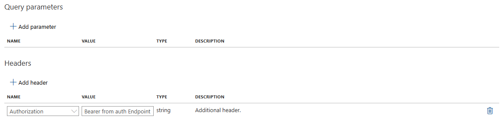
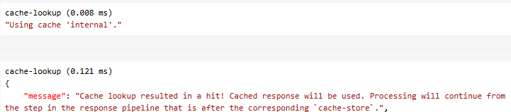
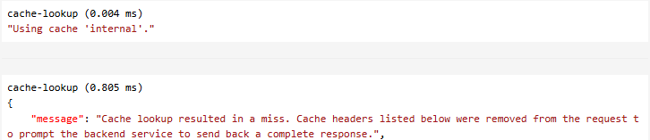

# Azure API Management services

Azure API Management is made up of an API gateway, a management plane, and a developer portal. These components are Azure-hosted and fully managed by default.

## Why need API Management?

API Management is needed because modern applications rely heavily on APIs to connect services, share data, and enable integrations across different platforms and teams. As the number and complexity of APIs grow, managing them becomes challenging. Here are the main reasons why API Management is important:

1. **Security**: API Management provides a secure way to expose APIs to external clients. It can enforce authentication and authorization policies, rate limiting, and IP whitelisting.
2. **Performance**: API Management can optimize API performance by caching responses, compressing data, and implementing load balancing.
3. **Monitoring**: API Management provides visibility into API usage and performance, helping you identify and address issues before they impact your users.
4. **Cost Management**: API Management can help you manage costs by providing tools to monitor and control API usage.

### Security

API Management provides a secure way to expose APIs to external clients. It can enforce authentication and authorization policies, rate limiting, and IP whitelisting.

####

```xml
<policies>
  <inbound>
    <!-- statements to be applied to the request go here -->
    <base /> <!-- Inherits inbound policies from higher scopes (e.g., global, product) -->
    <validate-jwt header-name="Authorization" failed-validation-httpcode="401" failed-validation-error-message="Unauthorized. Access token is missing or invalid.">
    <openid-config url="https://login.microsoftonline.com/{tenantId}/v2.0/.well-known/openid-configuration" />
    <audiences>
        <audience>{clientId}</audience>
    </audiences>
    <issuers>
        <issuer>https://login.microsoftonline.com/{tenantId}/v2.0</issuer>
    </issuers>
    </validate-jwt>
    <!-- Specific inbound policy for this API/operation -->
  </inbound>
  <backend>
     <base />
  </backend>
  <outbound>
    <!-- statements to be applied to the response go here -->
    <base />
  </outbound>
  <on-error>
    <!-- statements to be applied if there's an error condition go here -->
    <base />
  </on-error>
</policies>
```



### Performance

API Management can optimize API performance by caching responses, compressing data, and implementing load balancing.\
**Internal cache is not available in the Consumption tier of Azure API Management**
You can use **External Cache** (Azure Cache for Redis).

```xml
<policies>
  <inbound>
    <!-- statements to be applied to the request go here -->
    <base /> <!-- Inherits inbound policies from higher scopes (e.g., global, product) -->
    <cache-lookup vary-by-developer="false" vary-by-developer-groups="false" downstream-caching-type="none" must-revalidate="true" caching-type="internal" allow-private-response-caching="true">
        <vary-by-query-parameter>version</vary-by-query-parameter><!-- Vary by version query parameter -->
        <vary-by-header>Accept</vary-by-header>
        <!-- should be present in most cases -->
        <vary-by-header>Accept-Charset</vary-by-header>
        <!-- should be present in most cases -->
        <vary-by-header>Authorization</vary-by-header>
        <!-- should be present when allow-private-response-caching is "true"-->
        <vary-by-header>header name</vary-by-header>
        <!-- optional, can be repeated -->
        <vary-by-query-parameter>parameter name</vary-by-query-parameter>
        <!-- optional, can be repeated -->
    </cache-lookup>
    <!-- Specific inbound policy for this API/operation -->
  </inbound>
  <backend>
     <base />
  </backend>
  <outbound>
    <!-- statements to be applied to the response go here -->
    <base />
    <cache-store duration="300" /> <!-- 5 minutes -->
  </outbound>
  <on-error>
    <!-- statements to be applied if there's an error condition go here -->
    <base />

  </on-error>
</policies>
```

When the API have Authorization header, but missing allow-private-response-caching, the response will not be cached.\


When the response is cached, the response is returned from the cache.\


When the response is not cached or the cache is expired, the response is returned from the backend.\


For more information, see
[cache-lookup-policy](https://learn.microsoft.com/en-us/azure/api-management/cache-lookup-policy)

### Monitoring

API Management provides visibility into API usage, helping you identify and address issues before they impact your users.
For more monitor on performance, mount **Azure Applications Insight** to the APIM.

### Cost Management

API Management can help you manage costs by providing tools to monitor and control API usage.
You can check the cost under resources group - Cost Management.
