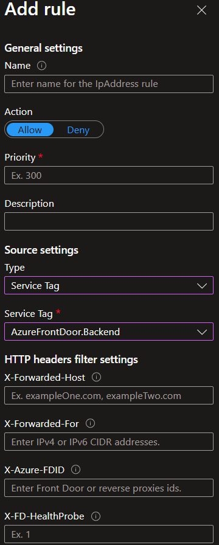

# Web App

Azure Web App

##Environment variable

```json
  {
    "name": "ASPNETCORE_ENVIRONMENT",
    "value": "prd",
    "slotSetting": false
  },
    {
    "name": "AzureAd:ClientCredentials:0:ClientSecret",
    "value": "@Microsoft.KeyVault(SecretUri=https://{your-vault-name}.vault.azure.net/secrets/{secrets-name})",
    "slotSetting": false
  },
  {
    "name": "WEBSITE_TIME_ZONE", // useful for function app trigger time
    "value": "China Standard Time",
    "slotSetting": false
  },
  {
    "name": "WEBSITE_WARMUP_PATH",
    "value": "/hc/health",
    "slotSetting": true
  }
```

## Access Restrictions

Use Service tag to limit access from Azure service IP.

