# Azure SQL

Azure SQL Database is a serverless database service.

Architecture

```mermaid
architecture-beta
    group azure(logos:microsoft-azure)[Azure]
    group SQL_Server(server)[sqlserver] in azure
    group pool(cloud)[Elastic Pool] in SQL_Server
    group SQL_Server2(server)[agent] in azure

    service db(database)[Database] in SQL_Server
    service db_1(database)[Databases] in pool
    service db_2(database)[Database] in SQL_Server2

    db_1:R <-- L:db_2


```



## Different between Azure SQL Server and Microsoft SQL Server

Azure SQL Server do not have SQL Server Agent.
To have a same function in Azure SQL server need to create a Elastic Job Agent on Azure.
Grant access for the Agent to the azure sql server as a worker.

\*\* If you want all sql server function, SQL managed instances is best for most migrations to the cloud.

### Data Migration

To migrate the Data from on-premises SQL Server to Azure, you can use **[Microsoft Data Migration Assistant](https://www.microsoft.com/en-us/download/details.aspx?id=53595)**.

### Set up Elastic Job Agent

```SQL
/****** init agent db  ******/
CREATE MASTER KEY ENCRYPTION BY PASSWORD='P@ssw0rd';

CREATE DATABASE SCOPED CREDENTIAL JobExecution
WITH IDENTITY = 'JobUser',
SECRET = 'P@ssw0rd';
GO

CREATE DATABASE SCOPED CREDENTIAL MasterUser
WITH IDENTITY = 'MasterUser',
SECRET ='P@ssw0rd';

/****** all azure server  ******/
CREATE LOGIN MasterUser
	WITH PASSWORD = 'P@ssw0rd';
GO

/****** create target group in agent db  ******/
EXEC jobs.sp_add_target_group 'ShardDatabase'

EXEC jobs.sp_add_target_group_member
N'ShardDatabase',
@target_type = N'SqlServer',
@refresh_credential_name = 'MasterUser',
@server_name ='dbserver.database.windows.net'

EXEC jobs.sp_add_target_group 'target_group'


EXEC jobs.sp_add_target_group_member N'target_group',
@target_type = N'SqlDatabase',
@server_name ='dbserver.database.windows.net',
@database_name ='db1'

--verify
SELECT * FROM jobs.target_groups
SELECT *
FROM jobs.target_group_members

/****** create job user in all master_DB ******/
CREATE LOGIN jobuser
	WITH PASSWORD = 'P@ssw0rd';
GO

CREATE USER jobuser
	FOR LOGIN jobuser
	WITH DEFAULT_SCHEMA = dbo
GO

/****** create login in target_DB ******/
CREATE USER jobuser
	FOR LOGIN jobuser
	WITH DEFAULT_SCHEMA = dbo
GO

EXEC sp_addrolemember N'db_owner', N'jobuser'


/****** create login in agent_DB ******/
CREATE USER jobuser
	FOR LOGIN jobuser
	WITH DEFAULT_SCHEMA = dbo
GO

EXEC sp_addrolemember N'db_owner', N'jobuser'

/****** create login in agent_DB ******/
EXEC jobs.sp_add_job @job_name ='job_name_1', @description ='description 1'

EXEC jobs.sp_add_jobstep @job_name = 'jobstep 1', @command = 'Select 1';', @step_name ='[Pre Processing]', @credential_name = 'JobExecution', @target_group_name= 'target_group'

EXEC jobs.sp_add_jobstep @job_name = 'jobstep 2', @command = 'Select 1', @step_name ='[step_name_2]', @credential_name = 'JobExecution', @target_group_name= 'target_group'

EXEC jobs.sp_add_jobstep @job_name = 'jobstep 3', @command = 'Select 1', @step_name ='[last_step]', @credential_name = 'JobExecution', @target_group_name= 'target_group'


--verify
SELECT *
    FROM jobs.jobs

SELECT * FROM jobs.job_versions

SELECT *
FROM jobs.jobsteps

--UTC time and update job start time
Exec jobs.sp_update_job @job_name='job_name_1', @enabled = 1, @schedule_interval_type ='Days', @schedule_start_time = N'2023-01-10 00:00:00'

```

## Json dataType

```sql
INSERT INTO jjsson ( [info]) VALUES( '[
  {
    "_id": "68806054b7a266dde87445a2",
    "index": 0,
    "guid": "58b49b33-68e3-446d-9ff6-c3259d9547cf",
    "isActive": false,
    "balance": "$2,947.30",
    "picture": "http://placehold.it/32x32",
    "age": 20,
    "eyeColor": "blue",
    "name": "Middleton Rios",
    "gender": "male",
    "company": "FURNITECH",
    "email": "middletonrios@furnitech.com",
    "phone": "+1 (934) 590-2233",
    "address": "925 Windsor Place, Fairmount, Nebraska, 6215",
    "about": "Reprehenderit nulla sit elit in eu magna magna id laborum deserunt anim aute. Laboris voluptate dolore dolor minim id Lorem anim reprehenderit ut quis labore deserunt incididunt exercitation. Adipisicing dolor culpa consequat do dolor fugiat et laborum voluptate id nisi in aliqua aliqua. Dolor esse nisi est pariatur. Sunt deserunt eu incididunt consectetur tempor tempor proident aliquip veniam dolore labore pariatur cupidatat.\r\n",
    "registered": "2021-02-19T02:29:36 -08:00",
    "latitude": -2.670389,
    "longitude": 77.98231,
    "tags": [
      "magna",
      "excepteur",
      "qui",
      "cupidatat",
      "amet",
      "ut",
      "anim"
    ],
    "friends": [
      {
        "id": 0,
        "name": "Vera Patterson"
      },
      {
        "id": 1,
        "name": "Erin Sanders"
      },
      {
        "id": 2,
        "name": "Kim Mitchell"
      }
    ],
    "greeting": "Hello, Middleton Rios! You have 4 unread messages.",
    "favoriteFruit": "apple"
  },
  {
    "_id": "688060542953d0374862ea3b",
    "index": 1,
    "guid": "8864d47a-2a04-407f-ab44-fb7438808963",
    "isActive": true,
    "balance": "$3,896.94",
    "picture": "http://placehold.it/32x32",
    "age": 35,
    "eyeColor": "green",
    "name": "Terra Powers",
    "gender": "female",
    "company": "DANCITY",
    "email": "terrapowers@dancity.com",
    "phone": "+1 (920) 451-3141",
    "address": "835 Madison Street, Saranap, South Dakota, 9711",
    "about": "Ex sunt aliqua officia mollit est eu Lorem. Amet enim velit ea elit. In duis Lorem veniam exercitation ad exercitation officia laboris incididunt. Deserunt aliqua tempor esse ipsum deserunt cupidatat. Cillum non esse reprehenderit consequat exercitation cillum duis voluptate cupidatat eiusmod. Culpa laborum et incididunt qui do sunt pariatur aliqua minim ea fugiat.\r\n",
    "registered": "2019-03-27T03:58:33 -08:00",
    "latitude": -44.648637,
    "longitude": 168.644222,
    "tags": [
      "velit",
      "pariatur",
      "aute",
      "tempor",
      "Lorem",
      "est",
      "enim"
    ],
    "friends": [
      {
        "id": 0,
        "name": "Witt Flynn"
      },
      {
        "id": 1,
        "name": "Marisol Morse"
      },
      {
        "id": 2,
        "name": "Bender Gould"
      }
    ],
    "greeting": "Hello, Terra Powers! You have 7 unread messages.",
    "favoriteFruit": "strawberry"
  },
  {
    "_id": "68806054bc2a389fafd43978",
    "index": 2,
    "guid": "af3808e7-3e0f-4349-90e7-afe3ddc5901f",
    "isActive": true,
    "balance": "$3,912.32",
    "picture": "http://placehold.it/32x32",
    "age": 32,
    "eyeColor": "brown",
    "name": "Walter Rush",
    "gender": "male",
    "company": "MIRACULA",
    "email": "walterrush@miracula.com",
    "phone": "+1 (950) 557-3120",
    "address": "448 Harbor Court, Malott, Federated States Of Micronesia, 1517",
    "about": "Anim ipsum consectetur consectetur voluptate commodo elit minim ea ex enim. Do exercitation nostrud mollit do fugiat pariatur magna. Anim voluptate minim ullamco incididunt ut cillum aute ut.\r\n",
    "registered": "2021-11-21T07:14:33 -08:00",
    "latitude": -76.5067,
    "longitude": -12.779176,
    "tags": [
      "enim",
      "dolor",
      "quis",
      "voluptate",
      "aliquip",
      "cillum",
      "laboris"
    ],
    "friends": [
      {
        "id": 0,
        "name": "Keith Conway"
      },
      {
        "id": 1,
        "name": "Nellie Clay"
      },
      {
        "id": 2,
        "name": "Lori Knowles"
      }
    ],
    "greeting": "Hello, Walter Rush! You have 9 unread messages.",
    "favoriteFruit": "strawberry"
  },
  {
    "_id": "6880605466779b33092bfd5a",
    "index": 3,
    "guid": "3465a938-76ba-4629-9b35-87ed4087edfb",
    "isActive": true,
    "balance": "$1,041.84",
    "picture": "http://placehold.it/32x32",
    "age": 37,
    "eyeColor": "green",
    "name": "Barlow Schultz",
    "gender": "male",
    "company": "SLUMBERIA",
    "email": "barlowschultz@slumberia.com",
    "phone": "+1 (819) 409-2902",
    "address": "238 Vanderbilt Avenue, Florence, New Hampshire, 5533",
    "about": "Laborum ipsum commodo veniam sint ad ut ut culpa. In exercitation aliquip dolore proident sunt in ex do amet eiusmod elit sit. Do qui et eu tempor aliquip qui excepteur do ullamco quis voluptate. Labore labore consectetur minim quis aute ea anim ea anim excepteur nulla. Cupidatat aute sit fugiat Lorem non veniam magna consequat exercitation excepteur amet Lorem eu. Esse consectetur fugiat sit non.\r\n",
    "registered": "2020-05-15T11:40:29 -08:00",
    "latitude": -53.022564,
    "longitude": -123.579747,
    "tags": [
      "id",
      "commodo",
      "officia",
      "nisi",
      "culpa",
      "do",
      "irure"
    ],
    "friends": [
      {
        "id": 0,
        "name": "Hanson English"
      },
      {
        "id": 1,
        "name": "Leanna Howe"
      },
      {
        "id": 2,
        "name": "Maxwell Pierce"
      }
    ],
    "greeting": "Hello, Barlow Schultz! You have 4 unread messages.",
    "favoriteFruit": "apple"
  },
  {
    "_id": "68806054a418207423594f72",
    "index": 4,
    "guid": "d63dff28-78b2-4a91-b3b8-116178a5a044",
    "isActive": true,
    "balance": "$3,377.47",
    "picture": "http://placehold.it/32x32",
    "age": 38,
    "eyeColor": "brown",
    "name": "Lara Burgess",
    "gender": "female",
    "company": "SONGLINES",
    "email": "laraburgess@songlines.com",
    "phone": "+1 (987) 432-2451",
    "address": "499 Vista Place, Wikieup, Delaware, 8335",
    "about": "Reprehenderit esse deserunt excepteur excepteur magna culpa minim amet occaecat deserunt anim. Consectetur id deserunt adipisicing voluptate laboris consectetur sunt minim commodo eiusmod fugiat velit. Pariatur occaecat esse dolor incididunt magna amet deserunt enim non do adipisicing. Quis deserunt irure et labore ut anim enim ut. Ullamco proident deserunt id duis excepteur aute aliqua et proident anim culpa magna.\r\n",
    "registered": "2023-12-22T09:25:47 -08:00",
    "latitude": 4.192028,
    "longitude": -52.130913,
    "tags": [
      "minim",
      "ipsum",
      "laborum",
      "esse",
      "magna",
      "voluptate",
      "dolore"
    ],
    "friends": [
      {
        "id": 0,
        "name": "Hampton Cole"
      },
      {
        "id": 1,
        "name": "West Swanson"
      },
      {
        "id": 2,
        "name": "Warren Tran"
      }
    ],
    "greeting": "Hello, Lara Burgess! You have 10 unread messages.",
    "favoriteFruit": "strawberry"
  }
]');
UPDATE [jjsson]
SET info.modify('$[0].age', 14859)
WHERE id = 2;
UPDATE jjsson
SET info.modify('$.b', 'def')
WHERE id = 1;

Select * from jjsson

DECLARE @info NVARCHAR(100) = '[{"name":"John","skills":["C#","SQL"]}]';
PRINT @info;

-- Update name
SET @info = JSON_MODIFY(@info, '$[0].name', 'Mike');
PRINT @info;

-- Insert surname
SET @info = JSON_MODIFY(@info, '$.surname', 'Smith');
PRINT @info;

-- Set name NULL
SET @info = JSON_MODIFY(@info, 'strict $.name', NULL);
PRINT @info;

-- Delete name
SET @info = JSON_MODIFY(@info, '$.name', NULL);
PRINT @info;

-- Add skill
SET @info = JSON_MODIFY(@info, 'append $.skills', 'Azure');
PRINT @info;
```
