# Azure SQL

Azure SQL Database is a serverless database service.

Architecture

```mermaid
architecture-beta
    group azure(logos:microsoft-azure)[Azure]
    group SQL_Server(server)[sqlserver] in azure
    group pool(cloud)[Elastic Pool] in SQL_Server
    group SQL_Server2(server)[agent] in azure

    service db(database)[Database] in SQL_Server
    service db_1(database)[Databases] in pool
    service db_2(database)[Database] in SQL_Server2

    db_1:R <-- L:db_2


```



## Different between Azure SQL Server and Microsoft SQL Server

Azure SQL Server do not have SQL Server Agent.
To have a same function in Azure SQL server need to create a Elastic job Agent on Azure.
Grant access for the Agent to the azure sql server as a worker.

```SQL
/****** init agent db  ******/
CREATE MASTER KEY ENCRYPTION BY PASSWORD='P@ssw0rd';

CREATE DATABASE SCOPED CREDENTIAL JobExecution
WITH IDENTITY = 'JobUser',
SECRET = 'P@ssw0rd';
GO

CREATE DATABASE SCOPED CREDENTIAL MasterUser
WITH IDENTITY = 'MasterUser',
SECRET ='P@ssw0rd';

/****** all azure server  ******/
CREATE LOGIN MasterUser
	WITH PASSWORD = 'P@ssw0rd';
GO

/****** create target group in agent db  ******/
EXEC jobs.sp_add_target_group 'ShardDatabase'

EXEC jobs.sp_add_target_group_member
N'ShardDatabase',
@target_type = N'SqlServer',
@refresh_credential_name = 'MasterUser',
@server_name ='dbserver.database.windows.net'

EXEC jobs.sp_add_target_group 'target_group'


EXEC jobs.sp_add_target_group_member N'target_group',
@target_type = N'SqlDatabase',
@server_name ='dbserver.database.windows.net',
@database_name ='db1'

--verify
SELECT * FROM jobs.target_groups
SELECT *
FROM jobs.target_group_members

/****** create job user in all master_DB ******/
CREATE LOGIN jobuser
	WITH PASSWORD = 'P@ssw0rd';
GO

CREATE USER jobuser
	FOR LOGIN jobuser
	WITH DEFAULT_SCHEMA = dbo
GO

/****** create login in target_DB ******/
CREATE USER jobuser
	FOR LOGIN jobuser
	WITH DEFAULT_SCHEMA = dbo
GO

EXEC sp_addrolemember N'db_owner', N'jobuser'


/****** create login in agent_DB ******/
CREATE USER jobuser
	FOR LOGIN jobuser
	WITH DEFAULT_SCHEMA = dbo
GO

EXEC sp_addrolemember N'db_owner', N'jobuser'

/****** create login in agent_DB ******/
EXEC jobs.sp_add_job @job_name ='job_name_1', @description ='description 1'

EXEC jobs.sp_add_jobstep @job_name = 'jobstep 1', @command = 'Select 1';', @step_name ='[Pre Processing]', @credential_name = 'JobExecution', @target_group_name= 'target_group'

EXEC jobs.sp_add_jobstep @job_name = 'jobstep 2', @command = 'Select 1', @step_name ='[step_name_2]', @credential_name = 'JobExecution', @target_group_name= 'target_group'

EXEC jobs.sp_add_jobstep @job_name = 'jobstep 3', @command = 'Select 1', @step_name ='[last_step]', @credential_name = 'JobExecution', @target_group_name= 'target_group'


--verify
SELECT *
    FROM jobs.jobs

SELECT * FROM jobs.job_versions

SELECT *
FROM jobs.jobsteps

--UTC time and update job start time
Exec jobs.sp_update_job @job_name='job_name_1', @enabled = 1, @schedule_interval_type ='Days', @schedule_start_time = N'2023-01-10 00:00:00'

```
